# Architektura — How You Doin'?

## Przegląd systemu

**How You Doin'?** to aplikacja do codziennego journalingu i refleksji emocjonalnej, zainspirowana serialem *Przyjaciele*. Użytkownik opisuje swój dzień wybierając jedną lub dwie „energie" (postacie Friendsów: Monica, Chandler, Ross, Joey, Phoebe, Rachel), pisze notatkę tekstową lub dyktuje ją głosem, opcjonalnie dołącza zdjęcie dnia. Aplikacja generuje narracyjną historię dnia, umożliwia rozmowę z wybranym AI-towarzyszem (6 postaci) oraz prezentuje tygodniowe podsumowania i statystyki. System oferuje zarówno interfejs webowy (PWA), jak i zewnętrzne API REST oraz serwer MCP do integracji z klientami AI.

---

## Diagram architektury

```mermaid
graph TD
    subgraph Browser["Przeglądarka / PWA"]
        UI[Next.js React<br/>App Router]
        SW[Service Worker<br/>sw-register.tsx]
        LS[localStorage<br/>demo mode + ustawienia + recap cache]
    end

    subgraph NextJS["Next.js Server — Vercel"]
        PAGE["/ /history /entry/[id]<br/>/login /onboarding /settings /week /docs"]
        API_JOEY["/api/joey<br/>streaming chat (auth)"]
        API_COMPANIONS["/api/companions/[id]/chat<br/>streaming chat (auth)"]
        API_ACCESS["/api/companions/access<br/>sprawdzenie dostępu"]
        API_RECAP["/api/recap<br/>tygodniowy recap AI"]
        API_STRIPE_SUB["/api/stripe/checkout/subscribe"]
        API_STRIPE_UNLOCK["/api/stripe/checkout/unlock"]
        API_STRIPE_PORTAL["/api/stripe/portal"]
        API_STRIPE_WEBHOOK["/api/stripe/webhook"]
        API_JOURNAL["/api/journal<br/>skill webhook"]
        API_MCP["/api/mcp/[transport]<br/>MCP server"]
        API_V1["/api/v1/*<br/>REST API"]
        AUTH_CB["/auth/callback<br/>OAuth redirect"]
    end

    subgraph Supabase["Supabase (PostgreSQL + Storage)"]
        DB_ENTRIES[(journal_entries)]
        DB_PROFILES[(user_profiles)]
        DB_SUBS[(user_subscriptions)]
        DB_UNLOCKS[(companion_unlocks)]
        STORAGE[Storage Bucket<br/>journal-photos]
        PGVECTOR[pgvector<br/>embeddings na wpisach]
        RPC[hybrid_search RPC]
    end

    subgraph StrapiCMS["Strapi CMS — Railway"]
        STRAPI_DB[(PostgreSQL<br/>treści statyczne)]
        STRAPI_API[Strapi REST API<br/>energies / companions<br/>couch-stories / ui-translation]
        STRAPI_ADMIN[Strapi Admin Panel]
    end

    subgraph PostHog["PostHog (EU)"]
        PH_EVENTS[Event capture<br/>session recording<br/>heatmaps]
        PH_DASH[Dashboard 778288]
    end

    subgraph Anthropic["Anthropic API"]
        HAIKU[claude-haiku-4-5<br/>recap + REST API]
        SONNET[claude-sonnet-4-6<br/>streaming chat]
    end

    subgraph Stripe["Stripe"]
        STRIPE_API[Stripe API<br/>checkout + portal]
        STRIPE_WH[Stripe Webhook<br/>events]
    end

    UI -->|fetch streaming + Bearer| API_JOEY
    UI -->|fetch streaming + Bearer| API_COMPANIONS
    UI -->|fetch + Bearer| API_ACCESS
    UI -->|fetch + Bearer| API_RECAP
    UI -->|fetch + Bearer| API_STRIPE_SUB
    UI -->|fetch + Bearer| API_STRIPE_UNLOCK
    UI -->|fetch + Bearer| API_STRIPE_PORTAL
    UI -->|Supabase JS SDK| DB_ENTRIES

    API_JOEY -->|streamText| SONNET
    API_COMPANIONS -->|streamText| SONNET
    API_RECAP -->|generateText| HAIKU

    API_STRIPE_SUB -->|create session| STRIPE_API
    API_STRIPE_UNLOCK -->|create session| STRIPE_API
    API_STRIPE_PORTAL -->|create portal| STRIPE_API
    STRIPE_WH -->|webhook events| API_STRIPE_WEBHOOK
    API_STRIPE_WEBHOOK -->|upsert| DB_SUBS
    API_STRIPE_WEBHOOK -->|insert| DB_UNLOCKS

    API_ACCESS -->|query| DB_SUBS
    API_ACCESS -->|query| DB_UNLOCKS
    API_RECAP -->|query 7 dni| DB_ENTRIES

    AUTH_CB -->|exchange code| Supabase
    API_JOURNAL -->|upsert| DB_ENTRIES
    API_MCP -->|CRUD| DB_ENTRIES
    API_V1 -->|CRUD| DB_ENTRIES

    API_CMS["/api/cms/translations<br/>proxy server-side"] -->|Bearer token| STRAPI_API
    UI -->|fetch on mount| API_CMS
    STRAPI_API --- STRAPI_DB
    STRAPI_ADMIN --- STRAPI_DB

    UI -->|instrumentation-client.ts| PH_EVENTS
    API_STRIPE_WEBHOOK -->|server-side event| PH_EVENTS
    PH_EVENTS --- PH_DASH
```



---

## Komponenty

### Frontend

| Komponent | Plik | Odpowiedzialność |
|-----------|------|-----------------|
| Strona główna (check-in) | `app/page.tsx` | Dzienny check-in: selektor energii, edytor notatki, ramka zdjęcia (wewnątrz karty, 180px), zapis wpisu |
| Historia | `app/history/page.tsx` | Lista wpisów + DateNavigator; desktop: two-panel (lista + detail) |
| Szczegół wpisu | `app/entry/[id]/page.tsx` | Mobilny widok pojedynczego wpisu |
| Ten tydzień | `app/week/page.tsx` | Tygodniowy recap AI + statystyki miesiąca (Couch Insights) |
| Onboarding | `app/onboarding/page.tsx` | Jednorazowy ekran z polem imienia |
| Ustawienia | `app/settings/page.tsx` | Przełącznik języka EN/PL, zarządzanie subskrypcją Stripe |
| Dokumentacja API | `app/docs/page.tsx` | Interaktywna dokumentacja REST + MCP dla developerów |
| ChemexLoader | `components/ChemexLoader.tsx` | Animowany SVG ekran ładowania |
| CouchSelector | `components/CouchSelector.tsx` | Kanapka SVG z ikonami postaci na siedziskach |
| EnergyCard | `components/EnergyCard.tsx` | Klikalne karty energii (siatka 3×2) |
| EnergyBadge | `components/EnergyBadge.tsx` | Kompaktowa etykieta energii w historii |
| DateNavigator | `components/DateNavigator.tsx` | Poziomy pasek dat z chipami (miesiąc) |
| JournalEditor | `components/JournalEditor.tsx` | Edytor TipTap + mikrofon (Web Speech API) + przycisk aparatu + slot `photoSlot` na ramkę zdjęcia |
| SnapshotFrame | `components/SnapshotFrame.tsx` | SVG ramka z inlinowanymi ścieżkami z frame.svg; obsługuje portrait/landscape, animacje wejścia/wyjścia; renderowana wewnątrz karty JournalEditor |
| CouchStoryBlock | `components/CouchStoryBlock.tsx` | Renderuje narrację dnia wygenerowaną z energii |
| EntryDetail | `components/EntryDetail.tsx` | Pełny widok wpisu z edycją i zarządzaniem zdjęciem |
| JoeyChat | `components/JoeyChat.tsx` | Panel czatu streaming; obsługuje 6 companionów; przełączanie persystuje w localStorage |
| CompanionSelector | `components/CompanionSelector.tsx` | Poziomy pasek ikon companionów w panelu czatu; zablokowane (🔒 + szare) dla nieopłaconych |
| CompanionUnlockCard | `components/CompanionUnlockCard.tsx` | Karta z opisem i przyciskiem zakupu indywidualnego companiona |
| JoeyInvite | `components/JoeyInvite.tsx` | Punkt wejścia do czatu: pasek mobilny / FAB desktop |
| BottomNav / DesktopNav | `components/BottomNav.tsx`, `DesktopNav.tsx` | Nawigacja 4-tabowa: Check-In · Journal · This Week (☕) · Settings |

### Backend (API Routes)

| Endpoint | Plik | Uwierzytelnienie | Opis |
|----------|------|-----------------|------|
| `POST /api/joey` | `app/api/joey/route.ts` | Bearer (Supabase JWT) | Strumieniowy czat z Joeyem; model claude-sonnet-4-6 |
| `POST /api/companions/[id]/chat` | `app/api/companions/[id]/chat/route.ts` | Bearer (Supabase JWT) | Strumieniowy czat z wybranym companionem; weryfikuje dostęp |
| `GET /api/companions/access` | `app/api/companions/access/route.ts` | Bearer (Supabase JWT) | Zwraca stan subskrypcji + listę indywidualnie odblokowanych |
| `POST /api/recap` | `app/api/recap/route.ts` | Bearer (Supabase JWT) | Tygodniowy recap AI (haiku-4-5, max 200 tokenów); wymaga ≥2 wpisów z ostatnich 7 dni |
| `POST /api/stripe/checkout/subscribe` | `app/api/stripe/checkout/subscribe/route.ts` | Bearer (Supabase JWT) | Tworzy sesję Stripe Checkout (subscription) |
| `POST /api/stripe/checkout/unlock` | `app/api/stripe/checkout/unlock/route.ts` | Bearer (Supabase JWT) | Tworzy sesję Stripe Checkout (one-time, unlock companiona) |
| `POST /api/stripe/portal` | `app/api/stripe/portal/route.ts` | Bearer (Supabase JWT) | Otwiera Stripe Billing Portal (anulowanie, zmiana karty) |
| `POST /api/stripe/webhook` | `app/api/stripe/webhook/route.ts` | HMAC-SHA256 (Stripe signature) | Obsługuje zdarzenia Stripe: `checkout.session.completed`, `customer.subscription.*` |
| `POST /api/journal` | `app/api/journal/route.ts` | `JOURNAL_SKILL_SECRET` (Bearer) | Webhook dla Claude Code Skill; user_id z `JOURNAL_SKILL_USER_ID` (env) |
| `GET/POST /api/mcp/[transport]` | `app/api/mcp/[transport]/route.ts` | API key SHA-256 | Serwer MCP: 4 narzędzia; transport SSE i streamable HTTP |
| `GET /api/v1/today` | `app/api/v1/today/route.ts` | API key Bearer | Dzisiejszy wpis + `couch_story` |
| `GET /api/v1/entries` | `app/api/v1/entries/route.ts` | API key Bearer | Lista wpisów (paginacja, filtr dat) |
| `POST /api/v1/entry` | `app/api/v1/entry/route.ts` | API key Bearer | Upsert wpisu |
| `POST /api/v1/ask-joey` | `app/api/v1/ask-joey/route.ts` | API key Bearer | Zapytanie do Joeya z hybridSearch; haiku-4-5 |
| `POST/DELETE /api/v1/photo` | `app/api/v1/photo/route.ts` | Supabase JWT | Upload/usunięcie zdjęcia |
| `GET/POST /api/v1/token` | `app/api/v1/token/route.ts` | Supabase JWT | Generowanie i podgląd klucza API |
| `GET /auth/callback` | `app/auth/callback/page.tsx` | brak (OAuth flow) | Wymiana kodu OAuth na sesję Supabase |
| `GET /api/cms/translations` | `app/api/cms/translations/route.ts` | brak (publiczne treści) | Proxy do Strapi: tłumaczenia UI + couch stories dla I18nProvider |

### Biblioteki (`lib/`)

| Plik | Odpowiedzialność |
|------|-----------------|
| `companions.ts` | Konfiguracja 6 companionów (`COMPANIONS`, `PERSONALITIES`, `COMPANION_ORDER`); `CompanionId`; `buildCompanionSystemPrompt()`; `buildRecapSystemPrompt()` |
| `companion-access.ts` | `hasCompanionAccess(userId, companionId, supabase)` — sprawdza subskrypcję i indywidualne unlocki |
| `auth-server.ts` | `getUserFromRequest(req)` — weryfikacja Supabase JWT z nagłówka Bearer; `getAdminSupabase()` — klient service_role |
| `auth-client.ts` | `getAuthToken()` — pobiera access token z sesji Supabase po stronie klienta |
| `stripe.ts` | Singleton klienta Stripe (`getStripe()`) |
| `storage.ts` | CRUD wpisów — abstrahuje Supabase vs localStorage (demo mode) |
| `photoStorage.ts` | Upload/delete zdjęć przez `/api/v1/photo`; resize przed wysłaniem |
| `imageUtils.ts` | Resize przez Canvas API (max 1600px, JPEG 85%); detekcja portrait/landscape |
| `search.ts` | `hybridSearch()` — embedding przez OpenAI + RPC `hybrid_search` w Supabase |
| `joey.ts` | `buildJoeySystemPrompt()` — system prompt z wpisem i historią; `needsHistoricalContext()` |
| `api-auth.ts` | `getUserFromApiKey()` — weryfikacja Bearer tokenu (SHA-256) dla REST API |
| `supabase.ts` | Singleton klienta Supabase (anon key) |
| `couchStories.ts` | Mapa 36 kombinacji energii → tytuł + historia dnia (EN/PL); `useCouchStory()` i `useCouchStoryResolver()` pobierają dane ze Strapi (przez i18n context) z fallbackiem na statyczny JSON |
| `energies.ts` | Konfiguracja 6 energii: kolor, opis, ikona |
| `i18n.tsx` | `I18nProvider` + `useI18n()` — ładuje statyczne `locales/*.json`, nadpisywane danymi ze Strapi (`/api/cms/translations`) po zamontowaniu komponentu |
| `strapi.ts` | Klient Strapi — `strapiGet<T>()` z server-only Bearer token; typy `Energy`, `CouchStory`, `Companion`, `UiTranslation` |
| `posthog-server.ts` | Singleton klienta PostHog Node.js do eventów server-side (np. z webhook Stripe) |
| `demo.ts` | Flaga `isDemoMode()` + CRUD na `localStorage` dla trybu demo |
| `types.ts` | Typy TypeScript (`JournalEntry`, `EnergyKey`) |

---

## Źródła danych

### Supabase PostgreSQL

**Tabela `journal_entries`**

| Kolumna | Typ | Opis |
|---------|-----|------|
| `id` | text (UUID) | Klucz główny |
| `user_id` | text | FK do `auth.users` |
| `date` | date | Data wpisu (YYYY-MM-DD); unique per user |
| `primary_energy` | text | Jedna z 6 energii lub NULL |
| `secondary_energy` | text | Opcjonalna druga energia |
| `content` | text | HTML z TipTap |
| `photo_url` | text | Publiczne URL zdjęcia w Storage lub NULL |
| `created_at` | timestamptz | Czas zapisu |

**Tabela `user_profiles`**

| Kolumna | Typ | Opis |
|---------|-----|------|
| `user_id` | text | FK do `auth.users` |
| `lang` | text | `"en"` lub `"pl"` |
| `api_key` | text | SHA-256 hash klucza API |
| `api_key_prefix` | text | Pierwsze 8 znaków klucza (do wyświetlania) |

**Tabela `user_subscriptions`**

| Kolumna | Typ | Opis |
|---------|-----|------|
| `user_id` | text | FK do `auth.users` |
| `stripe_customer_id` | text | ID klienta w Stripe |
| `stripe_subscription_id` | text | ID subskrypcji w Stripe |
| `status` | text | `active`, `canceled`, `past_due` itp. |
| `current_period_end` | timestamptz | Data końca aktualnego okresu rozliczeniowego |

**Tabela `companion_unlocks`**

| Kolumna | Typ | Opis |
|---------|-----|------|
| `id` | UUID | Klucz główny |
| `user_id` | text | FK do `auth.users` |
| `companion_id` | text | ID companiona (np. `"monica"`) |
| `created_at` | timestamptz | Data zakupu |

**Bucket Storage `journal-photos`**

Publiczny bucket. Ścieżka: `{user_id}/{date}.jpg`. JPEG, max 1600px.

### localStorage

| Klucz | Zawartość |
|-------|-----------|
| `hyd_name` | Imię użytkownika |
| `hyd_lang` | Język (`en` / `pl`) |
| `hyd_demo_entries` | Wpisy w trybie demo (JSON) |
| `hyd_active_companion` | Aktywny companion w panelu czatu |
| `hyd_recap_${companionId}_${weekStart}_${lang}` | Cache wygenerowanego recapu (klucz zawiera ID companiona, datę poniedziałku tygodnia i język) |

---

## System companionów

### Konfiguracja (`lib/companions.ts`)

6 companionów o typie `CompanionId`:

| ID | Imię | Dostęp | Ikona |
|----|------|--------|-------|
| `joey` | Joey | **free** | `/icons/joey.png` |
| `monica` | Monica | płatny | `/icons/monica.png` |
| `chandler` | Chandler | płatny | `/icons/chandler.png` |
| `ross` | Ross | płatny | `/icons/ross.png` |
| `phoebe` | Phoebe | płatny | `/icons/phoebe.png` |
| `rachel` | Rachel | płatny | `/icons/rachel.png` |

Każdy companion ma profil `PERSONALITIES[id]`: energy, perspective, tone, avoid, langInstruction.

### Logika dostępu

`hasCompanionAccess(userId, companionId, supabase)`:
1. `COMPANIONS[id].free === true` → dostęp
2. Aktywna subskrypcja w `user_subscriptions` (`status === "active"` i `current_period_end` w przyszłości) → dostęp
3. Wpis w `companion_unlocks` dla danego `user_id + companion_id` → dostęp
4. W przeciwnym razie → brak dostępu

### Prompt building

- `buildCompanionSystemPrompt(companionId, entries, lang)` — system prompt dla czatu
- `buildRecapSystemPrompt(companionId, weekContext, lang)` — system prompt dla tygodniowego recapu (bardziej narracyjny, bez listy, 2–4 zdania)

---

## Integracja Stripe

### Przepływ zakupu subskrypcji

```
UI → POST /api/stripe/checkout/subscribe (Bearer)
  → Stripe Checkout Session (mode: subscription)
  → redirect Stripe checkout → użytkownik płaci
  → Stripe webhook → POST /api/stripe/webhook (HMAC-SHA256)
  → upsert user_subscriptions
  → redirect /?subscribed=true
```

### Przepływ individual unlock

```
UI (CompanionUnlockCard) → POST /api/stripe/checkout/unlock { companion_id } (Bearer)
  → Stripe Checkout Session (mode: payment)
  → redirect Stripe checkout → użytkownik płaci
  → Stripe webhook → checkout.session.completed
  → insert companion_unlocks { user_id, companion_id }
  → redirect /?unlocked={companion_id}
```

### Billing portal

```
UI (Settings) → POST /api/stripe/portal (Bearer)
  → Stripe Billing Portal Session
  → redirect portal.stripe.com (anulowanie, zmiana karty)
  → return_url: NEXT_PUBLIC_APP_URL/settings
```

### Bezpieczeństwo Stripe

- Webhook weryfikowany przez HMAC-SHA256 (`STRIPE_WEBHOOK_SECRET`)
- Redirect URLs budowane z `NEXT_PUBLIC_APP_URL` (nie z nagłówka `Origin` — zabezpieczenie przed open redirect)

---

## Strona "This Week" (`/week`)

Dwie sekcje na jednej stronie:

### 1. This Week on the Couch (recap AI)

- Generowany przez `POST /api/recap` przy każdym załadowaniu (jeśli brak cache)
- Model: claude-haiku-4-5, max 200 tokenów
- Wymagane ≥2 wpisy z ostatnich 7 dni; inaczej empty state
- Cache w localStorage: `hyd_recap_${companionId}_${weekStartDate}_${lang}` (ważny przez tydzień)
- Companion: aktywny z `hyd_active_companion` (domyślnie Joey)

### 2. Couch Insights (statystyki)

Obliczane client-side z `getEntries()`, bez dodatkowych zapytań API:

| Sekcja | Opis |
|--------|------|
| Most Time on the Couch | Companion(i) z najwyższą liczbą wystąpień w bieżącym miesiącu; grid 2-kolumnowy |
| This Month's Couch | Paski energii ze wszystkich wpisów miesiąca (primary + secondary), posortowane malejąco |
| Days on the Couch | Liczba wpisów w bieżącym miesiącu |
| Snapshot Memories | Miniaturki zdjęć (64×64px) z wpisów miesiąca; klik → `/history?entry={id}` |

---

## Integracje i połączenia

### Anthropic API

| Użycie | Model | Klucz env |
|--------|-------|-----------|
| Czat w UI (streaming) — Joey + companioni | claude-sonnet-4-6 | `ANTHROPIC_API_KEY` |
| Tygodniowy recap (`/api/recap`) | claude-haiku-4-5 | `ANTHROPIC_API_KEY` |
| REST API ask-joey + MCP | claude-haiku-4-5 | `JOEY_ANTHROPIC_API_KEY` → `ANTHROPIC_API_KEY` |

### Supabase Auth (Google OAuth)

Przepływ: przeglądarka → Google OAuth → `/auth/callback` (page, nie route handler) → `exchangeCodeForSession` → sesja w cookies. Bearer token z sesji używany do autoryzacji w `/api/*`.

### MCP Server

`/api/mcp` — 4 narzędzia: `journal_get_today`, `journal_save_entry`, `journal_list_entries`, `joey_ask`. Transporty: SSE i streamable HTTP. Auth: SHA-256 z `user_profiles.api_key`.

---

## Hosting i deployment

| Aspekt | Szczegóły |
|--------|-----------|
| Hosting | Vercel — auto-deploy przy push do `main` |
| Framework | Next.js 15 App Router, runtime Node.js |
| Baza danych | Supabase (PostgreSQL + Auth + Storage) |
| CMS | Strapi 5 na Railway (`strapi-production-3cc2.up.railway.app`) — treści statyczne: energie, couch stories, tłumaczenia UI |
| Analityka | PostHog EU (`eu.posthog.com/project/211167`) — eventy, session recording, heatmaps; reverse-proxy przez `/ingest/*` |
| Płatności | Stripe (tryb test: `sk_test_*`, `pk_test_*`) |
| Uruchomienie lokalne | `npm run dev` → port 3000 |

---

## Zmienne środowiskowe

| Nazwa | Przeznaczenie |
|-------|--------------|
| `NEXT_PUBLIC_SUPABASE_URL` | URL projektu Supabase |
| `NEXT_PUBLIC_SUPABASE_ANON_KEY` | Klucz anonimowy Supabase |
| `SUPABASE_SECRET_KEY` | Klucz service_role (serwer) |
| `ANTHROPIC_API_KEY` | Klucz Anthropic (czat + recap) |
| `JOEY_ANTHROPIC_API_KEY` | Klucz Anthropic dedykowany REST API / MCP |
| `OPENAI_API_KEY` | Klucz OpenAI (embeddingi hybridSearch) |
| `STRIPE_SECRET_KEY` | Klucz Stripe (serwer) |
| `NEXT_PUBLIC_STRIPE_PUBLISHABLE_KEY` | Klucz Stripe (klient) |
| `STRIPE_WEBHOOK_SECRET` | Secret do weryfikacji podpisu webhooka Stripe |
| `STRIPE_PRICE_SUBSCRIPTION` | ID cennika subskrypcji w Stripe |
| `STRIPE_PRICE_MONICA` | ID cennika unlock Monica |
| `STRIPE_PRICE_CHANDLER` | ID cennika unlock Chandler |
| `STRIPE_PRICE_ROSS` | ID cennika unlock Ross |
| `STRIPE_PRICE_PHOEBE` | ID cennika unlock Phoebe |
| `STRIPE_PRICE_RACHEL` | ID cennika unlock Rachel |
| `NEXT_PUBLIC_APP_URL` | Publiczny URL aplikacji (redirect URLs Stripe) |
| `JOURNAL_SKILL_SECRET` | Shared secret dla webhook `/api/journal` |
| `JOURNAL_SKILL_USER_ID` | UUID użytkownika dla skill webhooka |
| `REDIS_URL` | Opcjonalny Redis dla mcp-handler |
| `STRAPI_URL` | URL Strapi CMS na Railway |
| `STRAPI_API_TOKEN` | Bearer token do Strapi (tylko server-side) |
| `NEXT_PUBLIC_POSTHOG_PROJECT_TOKEN` | Token PostHog (klient — NEXT_PUBLIC) |
| `NEXT_PUBLIC_POSTHOG_HOST` | Host PostHog (`/ingest` — reverse proxy) |

---

## Otwarte pytania / TODO

- **Struktura tabeli embeddingów** — `hybrid_search` RPC wywoływana, ale brak migracji SQL w repo. Migracje zarządzane bezpośrednio w panelu Supabase.
- **RLS** — włączony i skonfigurowany na wszystkich tabelach: `journal_entries`, `user_profiles`, `user_subscriptions`, `companion_unlocks`. Polityki widoczne w panelu Supabase → Authentication → Policies.
- **Rate limiting** — brak rate limitingu na endpointach AI (`/api/joey`, `/api/companions/*/chat`, `/api/recap`). Do rozważenia: Vercel WAF lub middleware.
- **Brak testów** — brak skryptów testowych i zależności testowych w `package.json`.
- **Demo mode + AI** — czat w trybie demo wywołuje `/api/joey` (wymaga auth); błąd nie jest obsłużony w UI.
