# Architektura — How You Doin'?

## Przegląd systemu

**How You Doin'?** to aplikacja do codziennego journalingu i refleksji emocjonalnej, zainspirowana serialem *Przyjaciele*. Użytkownik opisuje swój dzień wybierając jedną lub dwie „energie" (postacie Friendsów: Monica, Chandler, Ross, Joey, Phoebe, Rachel), pisze notatkę tekstową lub dyktuje ją głosem, opcjonalnie dołącza zdjęcie dnia. Aplikacja generuje na tej podstawie narracyjną historię dnia i umożliwia rozmowę z AI-towarzyszem Joeyem. System oferuje zarówno interfejs webowy (PWA), jak i zewnętrzne API REST oraz serwer MCP do integracji z klientami AI (Claude Desktop i in.).

---

## Diagram architektury

```mermaid
graph TD
    subgraph Browser["Przeglądarka / PWA"]
        UI[Next.js React<br/>App Router]
        SW[Service Worker<br/>sw-register.tsx]
        LS[localStorage<br/>demo mode + ustawienia]
    end

    subgraph NextJS["Next.js Server — Vercel"]
        PAGE["/  /history  /entry/[id]<br/>/login  /onboarding  /settings  /docs"]
        API_JOEY["/api/joey<br/>streaming chat"]
        API_JOURNAL["/api/journal<br/>skill webhook"]
        API_MCP["/api/mcp/[transport]<br/>MCP server"]
        API_V1_TODAY["/api/v1/today"]
        API_V1_ENTRIES["/api/v1/entries"]
        API_V1_ENTRY["/api/v1/entry"]
        API_V1_ASK["/api/v1/ask-joey"]
        API_V1_PHOTO["/api/v1/photo"]
        API_V1_TOKEN["/api/v1/token"]
        AUTH_CB["/auth/callback<br/>OAuth redirect"]
    end

    subgraph Supabase["Supabase (PostgreSQL + Storage)"]
        DB_ENTRIES[(journal_entries)]
        DB_PROFILES[(user_profiles)]
        STORAGE[Storage Bucket<br/>journal-photos]
        PGVECTOR[pgvector<br/>embeddings na wpisach]
        RPC[hybrid_search RPC]
    end

    subgraph Anthropic["Anthropic API"]
        HAIKU[claude-haiku-4-5<br/>REST API /v1/ask-joey<br/>MCP server]
        SONNET[claude-sonnet-4-6<br/>streaming /api/joey]
    end

    subgraph OpenAI["OpenAI API"]
        EMBED[text-embedding-3-small<br/>generowanie embeddingów]
    end

    subgraph External["Klienty zewnętrzne"]
        CLAUDE_DESKTOP[Claude Desktop<br/>MCP client]
        SKILL[Claude Code Skill<br/>journal webhook]
        AGENT[Agent API<br/>Bearer token]
    end

    UI -->|SSR + fetch| PAGE
    UI -->|fetch streaming| API_JOEY
    UI -->|fetch| API_V1_PHOTO
    UI -->|Supabase JS SDK| DB_ENTRIES
    UI -->|Supabase JS SDK| Supabase

    API_JOEY -->|ai-sdk generateText stream| SONNET
    API_JOEY -->|czyta historię| DB_ENTRIES

    API_V1_ASK -->|generateText| HAIKU
    API_V1_ASK -->|hybrid_search| RPC
    API_V1_ASK -->|czyta| DB_ENTRIES

    API_V1_TODAY -->|czyta| DB_ENTRIES
    API_V1_ENTRIES -->|czyta| DB_ENTRIES
    API_V1_ENTRY -->|upsert| DB_ENTRIES
    API_V1_PHOTO -->|upload| STORAGE
    API_V1_PHOTO -->|update photo_url| DB_ENTRIES
    API_V1_TOKEN -->|read/write api_key hash| DB_PROFILES

    API_MCP -->|narzędzia: get/save/list entries| DB_ENTRIES
    API_MCP -->|joey_ask| HAIKU
    API_MCP -->|weryfikacja tokenu| DB_PROFILES

    API_JOURNAL -->|webhook skill| DB_ENTRIES

    RPC -->|cosine similarity| PGVECTOR
    RPC -->|full-text search| DB_ENTRIES

    hybridSearch[lib/search.ts] -->|POST /v1/embeddings| EMBED
    API_V1_ASK --> hybridSearch

    AUTH_CB -->|exchange code for session| Supabase

    CLAUDE_DESKTOP -->|MCP SSE / HTTP| API_MCP
    SKILL -->|POST Bearer JOURNAL_SKILL_SECRET| API_JOURNAL
    AGENT -->|REST Bearer hyd_…| API_V1_TODAY
    AGENT -->|REST Bearer hyd_…| API_V1_ENTRIES
    AGENT -->|REST Bearer hyd_…| API_V1_ENTRY
    AGENT -->|REST Bearer hyd_…| API_V1_ASK

    DB_PROFILES -->|api_key SHA-256 hash| API_MCP
    DB_PROFILES -->|api_key SHA-256 hash| API_V1_ASK
```



---

## Komponenty

### Frontend

| Komponent | Plik | Odpowiedzialność |
|-----------|------|-----------------|
| Strona główna (check-in) | `app/page.tsx` | Dzienny check-in: selektor energii, edytor notatki, ramka zdjęcia, zapis wpisu |
| Historia | `app/history/page.tsx` | Lista wpisów + DateNavigator; desktop: two-panel (lista + detail) |
| Szczegół wpisu | `app/entry/[id]/page.tsx` | Mobilny widok pojedynczego wpisu |
| Onboarding | `app/onboarding/page.tsx` | Jednorazowy ekran z polem imienia |
| Ustawienia | `app/settings/page.tsx` | Przełącznik języka EN/PL |
| Dokumentacja API | `app/docs/page.tsx` | Interaktywna dokumentacja REST + MCP dla developerów |
| ChemexLoader | `components/ChemexLoader.tsx` | Animowany SVG ekran ładowania (kształt Chemex) |
| CouchSelector | `components/CouchSelector.tsx` | Kanapka SVG z ikonami postaci na siedziskach |
| EnergyCard | `components/EnergyCard.tsx` | Klikalne karty energii (siatka 3×2) |
| EnergyBadge | `components/EnergyBadge.tsx` | Kompaktowa etykieta energii w historii |
| DateNavigator | `components/DateNavigator.tsx` | Poziomy pasek dat z chipami (miesiąc) |
| JournalEditor | `components/JournalEditor.tsx` | Edytor TipTap + mikrofon (Web Speech API) + przycisk aparatu |
| SnapshotFrame | `components/SnapshotFrame.tsx` | SVG ramka z inlinowanymi ścieżkami z frame.svg; obsługuje portrait/landscape, animacje wejścia/wyjścia zdjęcia, clipPath |
| CouchStoryBlock | `components/CouchStoryBlock.tsx` | Renderuje narrację dnia wygenerowaną z energii |
| EntryDetail | `components/EntryDetail.tsx` | Pełny widok wpisu z edycją i zarządzaniem zdjęciem |
| JoeyChat | `components/JoeyChat.tsx` | Panel czatu streaming (claude-sonnet-4-6); historia sesji efemeryczna |
| JoeyInvite | `components/JoeyInvite.tsx` | Punkt wejścia do Joeya: pasek mobilny / FAB desktop |
| BottomNav / DesktopNav | `components/BottomNav.tsx`, `DesktopNav.tsx` | Nawigacja odpowiednio dla mobile i desktop |

### Backend (API Routes)

| Endpoint | Plik | Uwierzytelnienie | Opis |
|----------|------|-----------------|------|
| `POST /api/joey` | `app/api/joey/route.ts` | brak (wewnętrzny) | Strumieniowy czat z Joeyem; model claude-sonnet-4-6; nie persystuje historii |
| `POST /api/journal` | `app/api/journal/route.ts` | `JOURNAL_SKILL_SECRET` (Bearer) | Webhook dla Claude Code Skill — zapis wpisu dla hardkodowanego user_id |
| `GET/POST /api/mcp/[transport]` | `app/api/mcp/[transport]/route.ts` | API key SHA-256 (z `user_profiles`) | Serwer MCP: 4 narzędzia (`journal_get_today`, `journal_save_entry`, `journal_list_entries`, `joey_ask`); obsługuje transport SSE i streamable HTTP |
| `GET /api/v1/today` | `app/api/v1/today/route.ts` | API key Bearer | Zwraca dzisiejszy wpis + `couch_story` |
| `GET /api/v1/entries` | `app/api/v1/entries/route.ts` | API key Bearer | Lista wpisów (paginacja, filtr dat) |
| `POST /api/v1/entry` | `app/api/v1/entry/route.ts` | API key Bearer | Upsert wpisu (tworzy lub aktualizuje po dacie) |
| `POST /api/v1/ask-joey` | `app/api/v1/ask-joey/route.ts` | API key Bearer | Zapytanie do Joeya z hybridSearch; model claude-haiku-4-5 |
| `POST/DELETE /api/v1/photo` | `app/api/v1/photo/route.ts` | Supabase JWT (access token) | Upload/usunięcie zdjęcia w buckecie `journal-photos`; zapisuje `photo_url` w wpisie |
| `GET/POST /api/v1/token` | `app/api/v1/token/route.ts` | Supabase JWT | Generowanie i podgląd klucza API użytkownika; przechowuje tylko SHA-256 hash |
| `GET /auth/callback` | `app/auth/callback/route.ts` | brak (OAuth flow) | Wymiana kodu OAuth na sesję Supabase |

### Biblioteki (`lib/`)

| Plik | Odpowiedzialność |
|------|-----------------|
| `storage.ts` | CRUD wpisów — abstrahuje Supabase vs localStorage (demo mode) |
| `photoStorage.ts` | Upload/delete zdjęć przez `/api/v1/photo`; resize przed wysłaniem |
| `imageUtils.ts` | Resize przez Canvas API (max 1600px, JPEG 85%); detekcja portrait/landscape |
| `search.ts` | `hybridSearch()` — generuje embedding przez OpenAI, wywołuje RPC `hybrid_search` w Supabase |
| `joey.ts` | `buildJoeySystemPrompt()` — buduje system prompt z aktualnym wpisem i historią; `needsHistoricalContext()` — keyword matching dla EN/PL |
| `api-auth.ts` | `getUserFromApiKey()` — weryfikacja Bearer tokenu (SHA-256); `getAdminSupabase()` — klient z service key |
| `supabase.ts` | Singleton klienta Supabase (anon key, lazy init) |
| `couchStories.ts` | Statyczna mapa 36 kombinacji energii → tytuł + historia dnia (EN/PL) |
| `energies.ts` | Konfiguracja 6 energii: kolor, opis, ikona |
| `i18n.tsx` | Hook `useI18n()` — ładuje `locales/en.json` lub `locales/pl.json` z localStorage |
| `demo.ts` | Flaga `isDemoMode()` + CRUD na `localStorage` dla trybu demo |
| `types.ts` | Wspólne typy TypeScript (`JournalEntry`, `EnergyKey`) |

---

## Źródła danych

### Supabase PostgreSQL

**Tabela `journal_entries`**

| Kolumna | Typ | Opis |
|---------|-----|------|
| `id` | text (UUID) | Klucz główny |
| `user_id` | text | Powiązanie z `auth.users` |
| `date` | date | Data wpisu (YYYY-MM-DD); unique per user |
| `primary_energy` | text | Jedna z 6 energii lub NULL |
| `secondary_energy` | text | Opcjonalna druga energia |
| `content` | text | HTML z TipTap |
| `photo_url` | text | Publiczne URL zdjęcia w Storage (z `?v=timestamp`) lub NULL |
| `created_at` | timestamptz | Czas zapisu |
| (embedding) | vector | [do weryfikacji] embedding pgvector do hybridSearch |

**Tabela `user_profiles`**

| Kolumna | Typ | Opis |
|---------|-----|------|
| `user_id` | text | FK do `auth.users` |
| `lang` | text | `"en"` lub `"pl"` |
| `api_key` | text | SHA-256 hash klucza API (nigdy plaintext) |
| `api_key_prefix` | text | Pierwsze 8 znaków klucza (do wyświetlania) |

**Bucket Storage `journal-photos`**

Publiczny bucket. Ścieżka: `{user_id}/{date}.jpg`. Zdjęcia przechowywane jako JPEG, max 1600px szerokości. URL z cache-busterem `?v={timestamp}`.

**pgvector / `hybrid_search` RPC**

Funkcja PostgreSQL łącząca wyszukiwanie wektorowe (cosine similarity na embeddingach) z pełnotekstowym (full-text search). Wywoływana przez `lib/search.ts`. Zwraca pole `source` wskazujące, skąd pochodzi wynik (`vector | keyword | hybrid | recent`). Struktura tabeli embeddingów [do weryfikacji — nie znaleziono migracji w repo].

### localStorage (demo/ustawienia)

| Klucz | Zawartość |
|-------|-----------|
| `hyd_name` | Imię użytkownika |
| `hyd_lang` | Język (`en` / `pl`) |
| `hyd_demo_entries` | Wpisy w trybie demo (JSON) |

---

## Integracje i połączenia

### Anthropic API

| Użycie | Endpoint | Model | Klucz env | Kierunek |
|--------|----------|-------|-----------|----------|
| Czat w UI (streaming) | `/api/joey` | claude-sonnet-4-6 | `JOEY_ANTHROPIC_API_KEY` → `ANTHROPIC_API_KEY` | out |
| REST API ask-joey | `/api/v1/ask-joey` | claude-haiku-4-5 | `JOEY_ANTHROPIC_API_KEY` → `ANTHROPIC_API_KEY` | out |
| MCP `joey_ask` | `/api/mcp/…` | claude-haiku-4-5 | `JOEY_ANTHROPIC_API_KEY` → `ANTHROPIC_API_KEY` | out |

Uwaga: `JOEY_ANTHROPIC_API_KEY` ma priorytet nad `ANTHROPIC_API_KEY`, by uniknąć nadpisywania przez Claude Desktop.

### OpenAI API

| Użycie | Model | Klucz env | Kierunek |
|--------|-------|-----------|----------|
| Generowanie embeddingów do hybridSearch | text-embedding-3-small | `OPENAI_API_KEY` | out |

Wywoływane tylko gdy `/api/v1/ask-joey` uzna, że pytanie potrzebuje kontekstu historycznego.

### Supabase Auth (Google OAuth)

Przepływ: przeglądarka → Supabase Auth (Google OAuth) → redirect `/auth/callback` → `exchangeCodeForSession` → sesja zapisana w cookies/localStorage przez SDK. Callback URL: `https://<domena>/auth/callback`.

### MCP Server

Udostępniony pod `/api/mcp`. Obsługuje dwa transporty:
- **SSE** (`/api/mcp/sse`, `/api/mcp/message`) — dla starszych klientów
- **Streamable HTTP** (`/api/mcp/mcp`) — dla nowszych klientów

Uwierzytelnienie: Bearer token weryfikowany przez SHA-256 hash z `user_profiles.api_key`. Opcjonalne `REDIS_URL` [do weryfikacji — zmienna odczytywana przez `mcp-handler`, ale nie zdefiniowana w `.env.local`].

Cztery narzędzia MCP:
- `journal_get_today` — odczyt wpisu na datę
- `journal_save_entry` — upsert wpisu
- `journal_list_entries` — lista wpisów (filtr dat, limit 50)
- `joey_ask` — rozmowa z Joeyem z kontekstem historycznym

### Claude Code Skill (webhook)

Endpoint `POST /api/journal` przyjmuje Bearer token `JOURNAL_SKILL_SECRET` (shared secret, nie per-user). Wpisuje do bazy dla hardkodowanego `USER_ID`. Przeznaczony do integracji ze skill `journal` w Claude Code.

### PWA / Service Worker

Manifest + rejestracja service workera w `app/sw-register.tsx`. Ikony: `icon-192.png`, `icon-512.png`. Aplikacja instalowalna na mobile.

---

## Przepływ danych

### Dzienny wpis (ścieżka główna)

```
Użytkownik → UI (wybór energii + notatka + zdjęcie)
  → [zdjęcie] resizeImage() → POST /api/v1/photo → Supabase Storage
                                                   → UPDATE journal_entries.photo_url
  → [wpis]  saveEntry() → Supabase JS SDK → journal_entries (upsert)
  → redirect /history?entry={id}
```

### Czat z Joeyem (UI)

```
Użytkownik wpisuje wiadomość
  → JoeyChat.tsx zbiera recentEntries (localStorage → getEntries)
  → POST /api/joey { messages, currentEntry, recentEntries, lang }
  → buildJoeySystemPrompt() → streamText(claude-sonnet-4-6)
  → ReadableStream → UI (strumieniowo)
```

### Ask-Joey przez REST API (zewnętrzny agent)

```
Agent → POST /api/v1/ask-joey (Bearer hyd_...)
  → getUserFromApiKey() → SHA-256 lookup w user_profiles
  → needsHistoricalContext(message)?
      tak → hybridSearch():
              → OpenAI text-embedding-3-small (embedding)
              → Supabase RPC hybrid_search (vector + full-text)
      nie → (brak historii)
  → buildJoeySystemPrompt(currentEntry, recentEntries)
  → generateText(claude-haiku-4-5)
  → JSON { reply, context }
```

### MCP (Claude Desktop)

```
Claude Desktop → MCP SSE/HTTP (Bearer token)
  → withMcpAuth() → hash lookup w user_profiles
  → wywołanie narzędzia (np. journal_save_entry)
  → Supabase admin client → journal_entries
  → JSON response
```

### OAuth login

```
Przeglądarka → /login → "Sign in with Google"
  → Supabase Auth → Google OAuth
  → redirect /auth/callback?code=…
  → exchangeCodeForSession()
  → redirect /
```

---

## Hosting i deployment

| Aspekt | Szczegóły |
|--------|-----------|
| Hosting | **Vercel** — Git integration, automatyczny deploy przy każdym push do `main` |
| Framework | Next.js 15 App Router, runtime Node.js (wszystkie route handlers mają `export const runtime = "nodejs"`) |
| Baza danych | Supabase (managed PostgreSQL + Auth + Storage) — region [do weryfikacji] |
| Cache HTML | `Cache-Control: no-cache, no-store, must-revalidate` na wszystkich stronach (poza statycznymi assetami) |
| Uruchomienie lokalne | `npm run dev` → Next.js dev server na porcie 3000 |
| Budowanie | `npm run build` + `npm start` |
| Zmienne środowiskowe | Ustawiane w panelu Vercel; lokalnie w `.env.local` |
| PWA | Service worker + manifest; instalowalna na iOS/Android |

Nie ma Dockerfile, docker-compose ani cron jobów w repozytorium.

---

## Zmienne środowiskowe

| Nazwa | Przeznaczenie | Wymagana do |
|-------|--------------|-------------|
| `NEXT_PUBLIC_SUPABASE_URL` | URL projektu Supabase (publiczny) | Auth, DB, Storage |
| `NEXT_PUBLIC_SUPABASE_ANON_KEY` | Klucz anonimowy Supabase (publiczny) | Klient-side auth i DB |
| `SUPABASE_SECRET_KEY` | Klucz service_role Supabase (serwer) | Admin operacje w API routes |
| `ANTHROPIC_API_KEY` | Klucz Anthropic (fallback) | Joey chat i API |
| `JOEY_ANTHROPIC_API_KEY` | Klucz Anthropic dedykowany Joey (priorytet) | Joey chat i API |
| `OPENAI_API_KEY` | Klucz OpenAI | Embeddingi w hybridSearch |
| `JOURNAL_SKILL_SECRET` | Shared secret dla webhook `/api/journal` | Claude Code Skill |
| `REDIS_URL` | URL Redis (opcjonalny) | mcp-handler (transport MCP) |

---

## Otwarte pytania / TODO

- **Struktura tabeli embeddingów** — `hybrid_search` RPC istnieje w Supabase i jest wywoływana, ale nie znaleziono w repo żadnej migracji SQL definiującej tę funkcję ani kolumny `embedding` w `journal_entries`. [do weryfikacji — migracje mogą być zarządzane bezpośrednio w panelu Supabase]
- **REDIS_URL** — odczytywana przez `mcp-handler` (jako opcja konfiguracji), ale nie zdefiniowana w `.env.local`. Nie wiadomo, czy Redis jest używany na produkcji.
- **RLS (Row Level Security)** — nie widać polityk RLS w plikach repo. Operacje z `SUPABASE_SECRET_KEY` (service_role) omijają RLS. Czy RLS jest włączone dla klienta anon? [do weryfikacji w panelu Supabase]
- **Webhook `/api/journal` hardkoduje `USER_ID`** — endpoint dedykowany jest konkretnej osobie, nie jest multi-user. Zamierzone? Czy planowane uogólnienie?
- **Tryb demo bez Supabase** — demo mode działa w pełni offline przez localStorage. Joey chat w trybie demo wywołuje jednak `/api/joey`, które wymaga klucza Anthropic. Błąd w tym przypadku nie jest obsłużony w UI.
- **Brak testów** — w `package.json` nie ma skryptów testowych ani zależności testowych.
